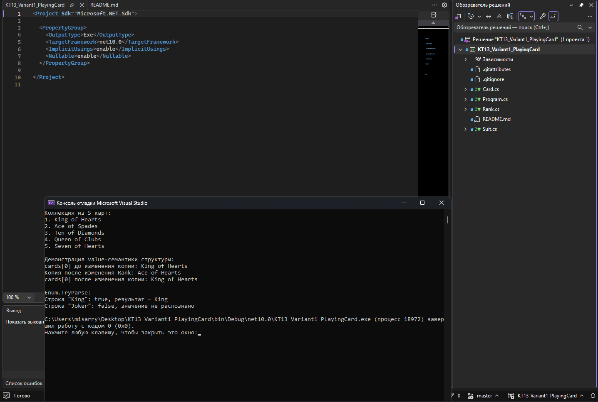
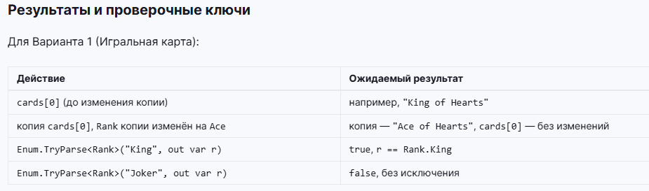

# КТ №13 — Структуры и перечисления

## Вариант 1. Игральная карта

Проект выполнен на C# для .NET 10 и Microsoft Visual Studio.

## Структура проекта

- `Program.cs` — основная программа.
- `Suit.cs` — перечисление мастей карты: `Clubs`, `Diamonds`, `Hearts`, `Spades`.
- `Rank.cs` — перечисление достоинств карты от `Two` до `Ace`.
- `Card.cs` — структура `Card` с полями `Suit` и `Rank` и переопределённым методом `ToString()`.
- `KT13_Variant1_PlayingCard.csproj` — файл проекта Visual Studio.
- `KT13_Variant1_PlayingCard.sln` — решение Visual Studio.
- `Screenshots/` — скриншоты выполнения и проверки задания.

## Выполненные требования

1. Создан массив из пяти игральных карт.
2. Элемент `cards[0]` прочитан из коллекции в отдельную локальную переменную `copy`.
3. У локальной копии изменён `Rank` на `Ace`.
4. После изменения копии исходный элемент `cards[0]` остался без изменений, что демонстрирует value-семантику структуры.
5. Реализован разбор строки через `Enum.TryParse<Rank>`.
6. Строка `"King"` успешно преобразуется в `Rank.King`.
7. Строка `"Joker"` не распознаётся, `Enum.TryParse` возвращает `false` без исключения.

## Результат выполнения программы

На скриншоте видно, что программа успешно запускается в Visual Studio и выводит коллекцию из пяти карт.

Для проверки value-семантики используется первая карта `King of Hearts`. После копирования `cards[0]` в локальную переменную у копии `Rank` изменяется на `Ace`. В результате копия становится `Ace of Hearts`, а исходная карта в массиве остаётся `King of Hearts`.

Также показана работа `Enum.TryParse`:

- `"King"` → `true`, результат `King`;
- `"Joker"` → `false`, значение не распознано.

## Результаты и проверочные ключи

Результат программы соответствует проверочным ключам задания:

| Действие | Полученный результат |
| --- | --- |
| `cards[0]` до изменения копии | `King of Hearts` |
| Копия `cards[0]`, `Rank` изменён на `Ace` | копия — `Ace of Hearts`, `cards[0]` — `King of Hearts` |
| `Enum.TryParse<Rank>("King", out var r)` | `true`, результат — `King` |
| `Enum.TryParse<Rank>("Joker", out var r)` | `false`, без исключения |

Ниже приведён скриншот проверочных ключей из задания:

## Итог

Все требования Варианта 1 выполнены. Программа демонстрирует работу структуры `Card`, двух перечислений `Suit` и `Rank`, независимость копии структуры при чтении элемента массива и безопасный разбор строковых значений перечисления через `Enum.TryParse`.
